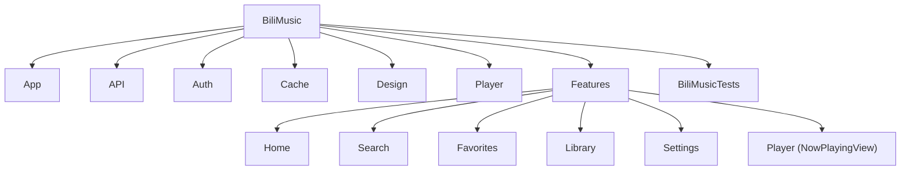

# CLAUDE.md

本文件为 Claude Code（claude.ai/code）在本仓库工作时提供指引。

## 模块结构



## 模块索引

| 模块 | 路径 | 入口 | 文件数 | 测试 |
|------|------|------|--------|------|
| App 入口 | `BiliMusic/App/` | `BiliMusicApp.swift` | 1 | 无 |
| API 层 | `BiliMusic/API/` | `BiliClient.swift` | 3 | 无 |
| 鉴权 | `BiliMusic/Auth/` | `CookieStore.swift` | 1 | 无 |
| 缓存 | `BiliMusic/Cache/` | `CacheStore.swift` | 2 | 无 |
| 设计 | `BiliMusic/Design/` | `AppTheme.swift` | 2 | 无 |
| 播放器引擎 | `BiliMusic/Player/` | `PlayerEngine.swift` | 7 | 无 |
| 首页推荐 | `BiliMusic/Features/Home/` | `HomeView.swift` | 2 | 无 |
| 搜索 | `BiliMusic/Features/Search/` | `SearchView.swift` | 3 | `BiliMusicTests/SearchModelsTests.swift` |
| 全屏播放器 | `BiliMusic/Features/Player/` | `NowPlayingView.swift` | 1 | 无 |
| 收藏夹 | `BiliMusic/Features/Favorites/` | `FavoritesView.swift` | 2 | 无 |
| 缓存列表 | `BiliMusic/Features/Library/` | `LibraryView.swift` | 1 | 无 |
| 设置 | `BiliMusic/Features/Settings/` | `SettingsView.swift` | 1 | 无 |

## 构建与运行

`.xcodeproj` 由 `project.yml` 生成，不入库。每当修改 `project.yml` 或新增 Swift 文件后都要重新生成：

```bash
xcodegen generate
```

编译检查（无交互式测试 —— 由用户在真机上验证）：

```bash
DEVELOPER_DIR=/Applications/Xcode.app/Contents/Developer \
  xcodebuild -project BiliMusic.xcodeproj -target BiliMusic \
  -sdk iphonesimulator CODE_SIGNING_ALLOWED=NO build
```

没有测试 target。所有验证都通过 AltStore 在真机 iPhone 上完成（免费开发者账号，签名 7 天有效需续签）。

## 架构

单 Module 的 SwiftUI app，iOS 17+，`@Observable` MVVM。无第三方依赖 —— 只用 URLSession + AVPlayer。

### 全局状态

`PlayerEngine` 是唯一的 `@Observable` 类，由 `BiliMusicApp` 通过 `.environment(engine)` 注入。视图用 `@Environment(PlayerEngine.self)` 读取。`CacheStore.shared` 和 `FavoriteManager.shared` 是单例，直接访问。

### 数据流

```
BiliClient (URLSession) → Track struct → PlayerEngine (queue + AVPlayer)
                        ↘ CacheStore (JSON index + Documents/audio/)
```

`Track` 是普通 `struct`（bvid、cid、title、artist、coverURL、duration）。音频/MV 流 URL 是**临时的**（约 2 小时过期）—— 只持久化 bvid/cid。每次播放都通过 `BiliClient.audioStream(bvid:cid:preferredQuality:)` 或 `videoStream(bvid:cid:profile:)` 现取新 URL。

### TrackKey（`BiliMusic/Player/PlayerEngine.swift` 中定义）

B 站视频可以有多个分 P（cid），缓存和去重不能只按 bvid。`TrackKey(bvid:cid:)` 标识精确到分 P，`matches(_:)` 方法支持模糊匹配（cid 为 nil 时只按 bvid 匹配）。`fileStem` 用于文件命名。

### API 层（`BiliMusic/API/`）

- **`BiliClient`** —— 所有 B站接口。每个请求都必须带上 `BiliClient.headers`（Referer + 浏览器 UA），否则 CDN 返回 403。存在 Cookie（`CookieStore.cookie`）时一并附上。包含：视频信息、音频流、搜索（WBI）、相关推荐、字幕、扫码登录、收藏夹 CRUD、UP 主合集/系列、首页推荐流、用户信息。
- **`WBISigner`** —— 搜索和首页推荐接口需要 WBI 签名。用 nav 接口的 img/sub key + 64 字符重排表混淆 → mixin key → 参数排序 + wts + MD5。key 缓存 12 小时。启动时调用 `WBISigner.prewarm()`。
- **`LyricsClient`** —— 仅用 LRCLIB。不 fallback 到 B站字幕（自动 CC 会产生「♪音乐♪」噪声）。从标题解析真实歌名/歌手 → LRCLIB 搜索 → 歌名相似 + 时长（差 ≤12 秒）双门槛匹配 → LRC 解析。
- 音质 ID：`30216`=64K，`30232`=132K，`30280`=192K，`30250`=杜比，`30251`=Hi-Res。权威清单是 `BiliClient.qualityOptions` —— 各处引用它，不要重复定义。
- URLSession 超时设为 12s（metadata 接口轻量），`waitsForConnectivity = true`。GET 方法走统一信封解析、解码在后台 Task 执行。

### 播放器（`BiliMusic/Player/`）

- **`PlayerEngine`** —— `@Observable @MainActor`。持有 `AVPlayer`、队列（`[Track]`）、`queueIndex`、播放状态、歌词以及 MV/音乐模式。核心方法：`play(tracks:startAt:)`、`playRadio(seed:)`、`playNext()`、`playPrevious()`、`jump(to:)`、`togglePlayPause()`。真正的状态通过 `player.timeControlStatus` KVO 同步 UI（`.playing`、`.paused`（用户主动 vs 缓冲断流）、`.waitingToPlayAtSpecifiedRate`）。`isScrubbing` 标志位防止拖动进度条时时间观察器与手势冲突。`preload(tracks:)` 支持批量预取；`schedulePreload(_:)` 供列表滚动时按需预加载。
- **`QueueController`** —— static 枚举，纯粹的队列操作函数：`nextIndex(mode:queueCount:currentIndex:)`（计算下一曲下标）、`appendUnique(_:to:)`（去重追加）、`remove(at:from:currentIndex:)`（删除并维护当前下标）。不持有状态，纯函数式。
- **`QueueMode`**：`.sequential`、`.shuffle`、`.repeatOne`、`.radio`。电台模式在当前歌曲开始播放后，通过 `RecommendationEngine` 预取下一首（`scheduleRadioPrefetch()` 延迟 700ms 触发）。
- **`RecommendationEngine`** —— 无状态 struct，`@MainActor`。三种模式：`.home`、`.radio`、`.relatedPanel`。从收藏夹（随机页）、相关推荐视频（`BiliClient.related`）、播放历史、歌单相邻曲目中取候选；用 `scoredPool`（确定性打分 + ±10 随机扰动）排序，`weightedSample`（Efraimidis–Spirakis 算法）加权随机抽样。缓存打分的候选池（8 分钟 TTL），每次调用从池子重新加权抽样（所以「换一批」每次结果不同）。`nextRadioTrack(after:excludedKeys:)` 取最佳下一首（不缓存、不随机）。
- **`MusicFilter`** —— 判定是否为音乐内容的启发式规则。`isMusic`（宽松，60~720s）、`isStrictMusic`（严格，75~540s）、`isSearchResultMusic`（搜索专用，结合分区 + 非音乐词 + 查询词相关性）、`isSearchResult`（按 mode 分发）。B 站音乐分区 `typeID` 集合：3、28、29、30、31、59、130、193、243、244。
- **`StreamResolver`** —— `@MainActor` class。负责把 Track 解析成可播放的音频流，维护短期 playurl 内存缓存（90 分钟 TTL）。`prepareAudio(for:preferredQuality:)` 返回 `PreparedAudioStream`（url, cid, duration, quality, bandwidth）。内部维护 `preparingStreams` 字典去重并发。`resolveCidDuration` 在 cid/duration 缺失时补全。
- **`NetworkMonitor`** —— `@Observable` 单例。用 `NWPathMonitor` 监测 `isWiFi` 状态，供「Wi-Fi 优先 MV」策略判断。
- **`PlaybackHistoryStore.shared`** —— `@Observable` 单例。JSON 存于 `Documents/playback-history.json`，上限 300 条。`record(_:)` 防抖写盘（1s 延迟）；`flush()` 立即写盘。后台 decode/encode。

### 鉴权（`BiliMusic/Auth/`）

- **`CookieStore`** —— 把完整 Cookie 字符串存在 Keychain 里。`cookie`（读写 Keychain，lazy load + 缓存）、`mid`（DedeUserID）、`csrf`（bili_jct）、`isLoggedIn`。key 字段：`SESSDATA`、`bili_jct`、`DedeUserID`。

### 缓存（`BiliMusic/Cache/`）

- **`CacheStore.shared`** —— `@Observable`。JSON 索引在 `Documents/cache_index.json`；音频文件在 `Documents/audio/{bvid}_{cid}.m4a`。`entry(for:)` 精确到 cid，多分 P 时 `ambiguousBVIDs` 避免误匹配。`add(_:)` / `remove(_:)` / `removeAll()`。防抖写盘。后台 decode/encode。
- **`DownloadManager.shared`** —— `@Observable` 单例。用 `URLSessionDownloadTask`（不是 `AsyncBytes`）。下载时带 `BiliClient.headers`。`progress` 字典暴露下载进度。`download(track:)` 补全 cid → 取流 → 下载 → 写索引。`preferredQuality` 从 `UserDefaults.integer(forKey: "downloadQuality")` 读。

### 设计（`BiliMusic/Design/`）

- **`AppTheme`** —— `accent = Color.primary`（不用 B站红）。`playerGradient` 是中性的系统渐变（`secondarySystemBackground` → `systemBackground`）。全部用系统语义色值。
- **`CachedAsyncImage`** —— 自定义图片加载 view（`CachedAsyncImage<Content, Placeholder>`）。2 层缓存：`ImageMemoryCache`（NSCache，cap 240 张/48MB）和 `ImageLoadCoordinator`（actor，URLSession + URLCache 32+128MB，同 URL 去重）。

### 功能页（`BiliMusic/Features/`）

- **`RootView`** —— tab bar（推荐/搜索/收藏/缓存/设置）+ 自定义全屏播放器浮层（不是 `.fullScreenCover`）。全屏播放器是 `NowPlayingView`，用 `.offset(y:).ignoresSafeArea()` 实现从 mini bar 上滑出现。`ScenePhase.background` 时 flush CacheStore + PlaybackHistoryStore。启动时 `AUTOPLAY_BV` 环境变量支持调试自动播。
- **`NowPlayingView`** —— 三页 `TabView`（队列 ← 当前歌曲 → 推荐）。三页：播放列表、正在播放、推荐歌曲。通过下滑手势关闭；阈值约 130pt 或预测约 260pt。包含：播放模式切换（音乐/MV）、音质选择、播放模式（顺序/随机/单曲循环/电台）、收藏（短按/长按选夹）、下载、歌词页、MV 全屏、合集检测（`upPlaylistContaining`）、迷你播放条上滑手势。内有独立子视图 `PlayerProgressBar` 限制 `currentTime` 订阅范围，防止全局重渲染。
- **`HomeView`** —— 出现时触发 `RecommendationEngine(.home)`；每次点「换一批」累积 `shownBVIDs` 以避免重复。去重机制：`RecentHomeFeedStore`（bvid → Date, 3h TTL, JSON 落盘，跨重启生效）。未登录/无收藏夹时显示引导。
- **`RecentHomeFeedStore`** —— 首页去重专用。bvid → 最近展示时间，JSON 落盘（`home-recent.json`），1s 防抖写盘。TTL 3h，max 400 条。
- **`SearchView`** —— 搜索入口。`SearchStore` 驱动：历史记录（UserDefaults，20 条上限）、搜索缓存（`resultCache`，同 query+mode 可恢复）、分页加载（自动跳过无结果页，最多 30 页）、模式切换（音乐/更多）。结果按 `SearchResultSections` 分为最佳匹配、歌曲、MV。`TrackRow` 组件在各列表复用。
- **`SearchStore`** —— `@Observable`。搜索状态管理：历史加载/记录、结果缓存、分页、模式切换。`searchBatch` 并发请求多个关键词+多页，`dedupeSearchTracks` 去重，`MusicFilter.isSearchResult` 过滤。`submitSearch` 调用 WBI 签名搜索。
- **`SearchModels`** —— `SearchResultMode`（music/expanded）、`SearchCacheKey`（归一化后做缓存 key）、`SearchCachedSnapshot`（缓存快照）、`SearchResultSections`（最佳匹配/歌曲/MV 三段式）。
- **`FavoritesView`** —— 收藏夹列表（B 站收藏夹当歌单用）。点击进入 `FavFolderDetailView` 分页加载，过滤失效稿件与非音乐。支持电台播放、随机播放、预加载。
- **`FavoriteManager`** —— `@Observable` 单例。维护已收藏 bvid 全集（跨收藏夹合并，10 分钟缓存）。`toggle(track:)` CRUD，带 busy 去重。默认收藏夹记忆（`lastFavoriteFolderId` UserDefaults）。`syncAllFavoriteIDs()` 供推荐去重使用。
- **`LibraryView`** —— 已缓存曲目列表。支持搜索、5 种排序（最近/标题/UP主/大小/音质）、删除（单个/swipe）、清空。缓存统计（数量+大小）。离线播放。
- **`SettingsView`** —— 设置页。账号：扫码登录 (`QRLoginView`)/登出。推荐种子收藏夹选择器。音质：播放音质 + 下载音质独立设置。缓存：自动缓存开关。播放：Wi-Fi 优先 MV、播放历史。`QRLoginView` 用 CIFilter 生成二维码，2s 轮询扫码结果。

### 测试策略

- **没有交互式 UI 测试** —— 所有验证在真机 iPhone 上完成（AltStore，免费开发者账号，签名 7 天有效需续签）。
- **编译验证** —— `xcodebuild` 构建命令检查编译错误。
- **单元测试** —— `BiliMusicTests/SearchModelsTests.swift` 是对 `SearchModels` 和 `SearchStore` 的纯逻辑测试，不依赖网络或 UIKit。测试要点：SearchCacheKey 归一化、SearchResultMode 值、SearchResultSections 三段拆分、MusicFilter 过滤逻辑、SearchStore 缓存恢复和模式切换。
- **调试环境变量** —— `AUTOPLAY_BV` 环境变量可注入在模拟器上自动播放测试，`AUTOPLAY_TEST_NEXT` 可测切歌。
- **脚本** —— `scripts/verify_audio.py`、`scripts/verify_search_rcmd.py` 用于验证 API 响应结构。

## 关键约束

- **不做模拟器交互测试** —— 只做编译验证；真机测试由用户完成。
- **不强加红色/品牌主色** —— `AppTheme.accent` 保持 `Color.primary`。
- **不做专辑封面虚化背景** —— 用 `AppTheme.playerGradient`（中性）。
- **封面是 16:9** —— B站封面是 16:9；用 `height: coverSize * 9/16`，不要用正方形。
- **新增 Swift 文件要 `xcodegen generate`** —— `.xcodeproj` 是生成的；加文件不重新生成，Xcode 找不到。
- **流 URL 不可持久化** —— 只把 bvid/cid 落盘；URL 约 2 小时后过期。
- **不要在 URL 上二次 `addingPercentEncoding`** —— WBISigner 已做百分号编码；二次编码会把 `%E5` 变成 `%25E5`，服务器收到字面量而非中文。
- **搜索只显示音乐内容** —— 默认 `.music` 模式过滤；用户可切换 `.expanded` 查看更多。
- **不 fallback 到 B 站字幕** —— 自动 CC 会把伴奏标成「♪音乐♪」，只用 LRCLIB 在线歌词。

## 变更记录 (Changelog)

| 日期 | 变更 |
|------|------|
| 2026-06-24 | 初始架构文档生成。覆盖全部 13 个模块 / 28 Swift 文件 / 1 测试文件。 |
