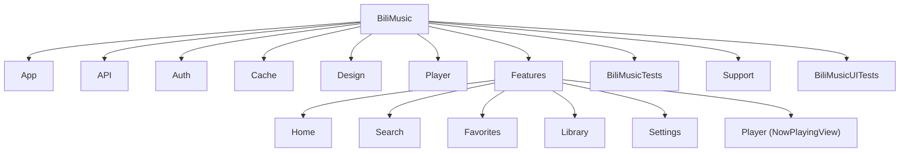

# CLAUDE.md

本文件是 Bilibili Music 的项目协作规则与架构主本。Claude Code 直接读取本文件；其他代理通过根目录 `AGENTS.md` 进入，并在开展实质工作前读取本文件。该 Claude-first 布局由用户于 2026-08-05 明确选择，是对 Project Cairn 默认 `AGENTS.md` 主本布局的项目级适配。

## 项目一句话

面向个人自用的 SwiftUI iPhone 音乐客户端：沿用 Apple Music 式系统交互，使用 B 站 16:9 封面驱动的“横版影像唱片机”视觉，快速、稳定地播放和管理音乐内容。

> Project Cairn 已按本项目自身定位和 provider 配置初始化；其他项目不得直接复制本配置，应分别初始化。

## 初始化配置

- 毕业 provider：Obsidian（vault：`Obsidian Vault`）
- 知识库索引：`Knowledge/Bilibili Music/INDEX.md`
- 毕业目标：`Knowledge/Bilibili Music`
- 项目知识：提交 `cairn/`；单独忽略可能含外部或敏感原始材料的 `cairn/Reference/`
- 历史迁移：`start_fresh`
- 文档语言：中文

## 进入项目后的阅读顺序

1. 先读本文件，获取项目规则、关键约束与架构导航。
2. 在规划实质工作前，读 `.planning/PROJECT.md`、`.planning/STATE.md`、`.planning/ROADMAP.md` 和 `.planning/REQUIREMENTS.md`；它们是执行状态、阶段计划与需求追踪的当前权威来源。
3. 读 `cairn/ROADMAP.md`，获取跨会话的精简焦点与开放问题；不得在其中复制完整执行计划。
4. 读 `cairn/LOG.md` 顶部的最新记录，了解近期进展与关键决策。
5. 按当前任务读取相关 `cairn/` 知识专题文档。

## 文档职责

| 文件 | 职责 | 维护方式 |
|---|---|---|
| `CLAUDE.md`（根目录） | 项目规则、导航与架构主本 | 有意识地更新；规则冲突时优先 |
| `AGENTS.md`（根目录） | 非 Claude 代理的精简入口 | 很少改动，只桥接到本文件 |
| `.planning/` | 执行状态、阶段计划、需求与追踪 | 按 GSD 工作流维护，作为计划权威来源 |
| `cairn/ROADMAP.md` | 跨会话的精简路线图与开放问题 | 原地更新，避免复制 `.planning/ROADMAP.md` |
| `cairn/LOG.md` | 反向时间顺序的进展日志 | 最新记录加在顶部；每条不超过 20 行，只写摘要与指针 |
| `cairn/<topic>.md` | 知识专题文档，保存当前真相 | 原地更新；修订时在 LOG 留指针 |
| `cairn/Reference/` | 外部原始输入 | 按需创建，只追加；本项目不提交 Git |
| `cairn/Cited.md` | 知识库引用清单 | 仅保存指针，不复制来源正文 |

> 只有出现具体信号时才创建其他 Cairn 文件：需要记录决策、解决可复用陷阱或目标跨越一个会话。代码或流程直接消费的合同、配置和规范仍留在工程目录，不放入 `cairn/`。

## 冲突仲裁规则

- 项目内同层文档的规则级冲突以本文件为准，不覆盖系统、开发者或当前用户指令；执行状态、阶段计划和需求追踪以 `.planning/` 为准。
- 可复用的业务或设计结论以最新知识专题文档为准，优先级为 **知识专题文档 > LOG 历史**。
- 不用较旧的 LOG 记录覆盖后续已确认的当前真相。

## 知识库使用反射

- 在开展任何其可复用内核——它产出或依赖的任何结论——够格毕业的工作之前，先检查 Obsidian 的 `Knowledge/Bilibili Music/INDEX.md`；只有知识库笔记确实影响了产出时，才在 `cairn/Cited.md` 添加指针，绝不复制来源正文。

## 文档协作规则

- 修改文档前，先判断用户要“讨论/建议”还是“直接编辑”；用户说“先看看/先评估”时，先给分析，不直接重写正式文档。
- 修正过去判断时追加更正说明，不静默覆盖历史判断。
- 未经确认的判断不得写成既定事实。

## 知识沉淀规则

- 每次取得实质进展后，在 `cairn/LOG.md` 顶部添加一条摘要与指针；稳定结论沉淀到相应知识专题文档。
- **完成回复门禁：**在任何宣称工作已完成、已实现、已定稿、已更新、已同步或已验证，测试已通过，问题已修复或解决，交付物已可用，工作已结束，或使用语义等价表述之前，按 Project Cairn 技能的 `references/maintenance.md` 运行 Cairn 检查点；只更新触发矩阵要求的记录并验证后再回复。用户明确要求只读或不编辑时，禁止 Cairn 写入。
- 跨项目可复用的经验通过毕业机制沉淀到 Obsidian 的 `Knowledge/Bilibili Music`。

## 项目上下文与工作流

- 当前状态：v1 的四个阶段已经完成；下一步是最终真机确认，再决定是否进入 v2 的 API、认证、缓存与音乐功能打磨。
- 核心价值：让音乐尽快、稳定地响起来。播放启动速度和不中断播放优先于歌词、推荐、MV、图片、缓存工作和 UI 润色。
- `.planning/ROADMAP.md` 与 `.planning/REQUIREMENTS.md` 是范围和追踪的权威来源；维护路线图或范围时必须保留需求可追踪性。

### CodeGraph

- 若仓库根目录存在 `.codegraph/`，定位或理解源码时先使用 `codegraph_explore`；查看特定符号用 `codegraph_node`；修改共享函数或回调前用 `codegraph_callers`。若索引不存在，则使用 `rg` 等常规工具，不自行创建索引。
- 若 CodeGraph 报告编辑后的文件已过期，再直接读取那些具体文件。

### GSD 工作流

- 阶段工作使用当前阶段编号调用 `$gsd-discuss-phase <N>` 或 `$gsd-plan-phase <N>`，不得继续假定当前仍是 Phase 1。
- v1 稳定化结果是后续工作的基线；未经明确范围决策，不把宽泛的 v2 API、认证或缓存重写混入窄范围稳定性工作。

### Git 安全

- 未经明确要求，不回退用户或先前代理的未提交修改。
- 只暂存当前任务相关文件；规划文档与源码提交尽量分开。

## 架构资料说明

下方架构说明最初生成于 2026-06-24，保留为主本中的工程导航。文件数量、测试覆盖和具体 UI 行为可能随代码演进而过期；若与当前源码、CodeGraph 或 `.planning/` 冲突，以当前证据为准，并在确认后更新本文件。

## 模块结构



## 模块索引

| 模块 | 路径 | 主要入口 |
|------|------|----------|
| App 入口 | `BiliMusic/App/` | `BiliMusicApp.swift` |
| API 层 | `BiliMusic/API/` | `BiliClient.swift` |
| 鉴权 | `BiliMusic/Auth/` | `CookieStore.swift` |
| 缓存 | `BiliMusic/Cache/` | `CacheStore.swift` |
| 设计 | `BiliMusic/Design/` | `AppTheme.swift` |
| 播放器引擎 | `BiliMusic/Player/` | `PlayerEngine.swift` |
| 首页推荐 | `BiliMusic/Features/Home/` | `HomeView.swift` |
| 搜索 | `BiliMusic/Features/Search/` | `SearchView.swift` |
| 全屏播放器 | `BiliMusic/Features/Player/` | `NowPlayingView.swift` |
| 收藏夹 | `BiliMusic/Features/Favorites/` | `FavoritesView.swift` |
| 缓存列表 | `BiliMusic/Features/Library/` | `LibraryView.swift` |
| 设置 | `BiliMusic/Features/Settings/` | `SettingsView.swift` |
| UI 测试支持 | `BiliMusic/Support/` | `UITestFixtures.swift` |
| 单元测试 | `BiliMusicTests/` | 各领域 XCTest 文件 |
| UI 回归测试 | `BiliMusicUITests/` | `PlayerChromeUITests.swift` |

## 构建与运行

`.xcodeproj` 由 `project.yml` 生成，不入库。每当修改 `project.yml` 或新增 Swift 文件后都要重新生成：

```bash
xcodegen generate
```

`docs/` 通过 `project.yml` 的顶层 `fileGroups` 显示在 Xcode Project Navigator，仅用于阅读，不加入任何 target 或 App bundle。不要在 Xcode 中手工拖入文档；生成工程时应始终以 `project.yml` 为准。

**首次拉取**需要先建本地签名配置（签名 Team ID 不入库，各自维护）：

```bash
cp Local.xcconfig.example Local.xcconfig   # 填入自己的 Apple 开发者 Team ID
```

所需 Xcode 版本见仓库根 `.xcode-version`（当前 26.5；iOS 26 部署目标需 Xcode 26 SDK）。

编译检查：

```bash
DEVELOPER_DIR=/Applications/Xcode.app/Contents/Developer \
  xcodebuild -project BiliMusic.xcodeproj -scheme BiliMusic \
  -destination 'generic/platform=iOS Simulator' \
  CODE_SIGNING_ALLOWED=NO build
```

`project.yml` 定义了 `BiliMusicTests` 与 `BiliMusicUITests` target；稳定性回归可在模拟器运行，日常播放路径仍需通过 AltStore 在用户自己的 iPhone 上做最终确认（免费开发者账号，签名 7 天有效需续签）。

## 架构

单 Module 的 SwiftUI app，iOS 26.0+（部署目标有意保持 26.0），`@Observable` MVVM。网络和播放层只用 URLSession + AVPlayer。首页封面到播放器使用 Home 局部 matched geometry 动画层；mini player 的展开、跟手下滑和收回继续使用项目内 vendored 的 MIT 依赖 LNPopupUI/LNPopupController。

### 全局状态

`PlayerEngine` 是唯一通过 SwiftUI environment 注入的全局播放状态，由 `BiliMusicApp` 通过 `.environment(engine)` 提供，视图用 `@Environment(PlayerEngine.self)` 读取。搜索、网络、历史、收藏、缓存和下载等功能使用各自的 observable store 或单例。

### 数据流

```
BiliClient (URLSession) → Track struct → PlayerEngine (queue + AVPlayer)
                        ↘ CacheStore (JSON index + Documents/audio/)
```

`Track` 是普通 `struct`（bvid、cid、title、artist、coverURL、duration）。音频/MV 流 URL 是**临时的**（约 2 小时过期）—— 只持久化 bvid/cid。每次播放都通过 `BiliClient.audioStream(bvid:cid:preferredQuality:)` 或 `videoStream(bvid:cid:profile:)` 现取新 URL。

### TrackKey（`BiliMusic/Player/PlayerEngine.swift` 中定义）

B 站视频可以有多个分 P（cid），缓存和去重不能只按 bvid。`TrackKey(bvid:cid:)` 标识精确到分 P，`matches(_:)` 方法支持模糊匹配（cid 为 nil 时只按 bvid 匹配）。`fileStem` 用于文件命名。

### API 层（`BiliMusic/API/`）

- **`BiliClient`** —— 所有 B站接口。每个请求都必须带上 `BiliClient.headers`（Referer + 浏览器 UA），否则 CDN 返回 403。存在 Cookie（`CookieStore.cookie`）时一并附上。包含：视频信息、音频流、搜索（WBI）、相关推荐、字幕、扫码登录、收藏夹 CRUD、UP 主合集/系列、首页推荐流、用户信息。
- **`WBISigner`** —— 搜索和首页推荐接口需要 WBI 签名。用 nav 接口的 img/sub key + 64 字符重排表混淆 → mixin key → 参数排序 + wts + MD5。key 缓存 12 小时。启动时调用 `WBISigner.prewarm()`。
- **`LyricsClient`** —— 仅用 LRCLIB。不 fallback 到 B站字幕（自动 CC 会产生「♪音乐♪」噪声）。从标题解析真实歌名/歌手 → LRCLIB 搜索 → 歌名相似 + 时长（差 ≤12 秒）双门槛匹配 → LRC 解析。
- 音质 ID：`30216`=64K，`30232`=132K，`30280`=192K，`30250`=杜比，`30251`=Hi-Res。权威清单是 `BiliClient.qualityOptions` —— 各处引用它，不要重复定义。
- URLSession 超时设为 12s（metadata 接口轻量），`waitsForConnectivity = true`。GET 方法走统一信封解析、解码在后台 Task 执行。

### 播放器（`BiliMusic/Player/`）

- **`PlayerEngine`** —— `@Observable @MainActor`。持有 `AVPlayer`、队列（`[Track]`）、`queueIndex`、播放状态、歌词以及 MV/音乐模式。核心方法：`play(tracks:startAt:)`、`playRadio(seed:)`、`playNext()`、`playPrevious()`、`jump(to:)`、`togglePlayPause()`。真正的状态通过 `player.timeControlStatus` KVO 同步 UI（`.playing`、`.paused`（用户主动 vs 缓冲断流）、`.waitingToPlayAtSpecifiedRate`）。`isScrubbing` 标志位防止拖动进度条时时间观察器与手势冲突。`preload(tracks:)` 支持批量预取；`schedulePreload(_:)` 供列表滚动时按需预加载。
- **`QueueController`** —— static 枚举，纯粹的队列操作函数：`nextIndex(mode:queueCount:currentIndex:)`（计算下一曲下标）、`appendUnique(_:to:)`（去重追加）、`remove(at:from:currentIndex:)`（删除并维护当前下标）。不持有状态，纯函数式。
- **`QueueMode`**：`.sequential`、`.shuffle`、`.repeatOne`、`.radio`。电台模式在当前歌曲开始播放后，通过 `RecommendationEngine` 预取下一首（`scheduleRadioPrefetch()` 延迟 700ms 触发）。
- **`RecommendationEngine`** —— 无状态 struct，`@MainActor`。三种模式：`.home`、`.radio`、`.relatedPanel`。从收藏夹（随机页）、相关推荐视频（`BiliClient.related`）、播放历史、歌单相邻曲目中取候选；用 `scoredPool`（确定性打分 + ±10 随机扰动）排序，`weightedSample`（Efraimidis–Spirakis 算法）加权随机抽样。缓存打分的候选池（8 分钟 TTL），每次调用从池子重新加权抽样（所以「换一批」每次结果不同）。`nextRadioTrack(after:excludedKeys:)` 取最佳下一首（不缓存、不随机）。
- **`MusicFilter`** —— 判定是否为音乐内容的启发式规则。`isMusic`（宽松，60~720s）、`isStrictMusic`（严格，75~540s）、`isSearchResultMusic`（搜索专用，结合分区 + 非音乐词 + 查询词相关性）、`isSearchResult`（按 mode 分发）。B 站音乐分区 `typeID` 集合：3、28、29、30、31、59、130、193、243、244。
- **`StreamResolver`** —— `@MainActor` class。负责把 Track 解析成可播放的音频流，维护短期 playurl 内存缓存（90 分钟 TTL）。`prepareAudio(for:preferredQuality:)` 返回 `PreparedAudioStream`（url, cid, duration, quality, bandwidth）。内部维护 `preparingStreams` 字典去重并发。`resolveCidDuration` 在 cid/duration 缺失时补全。
- **`NetworkMonitor`** —— `@Observable` 单例。用 `NWPathMonitor` 监测 `isWiFi` 状态，供「Wi-Fi 优先 MV」策略判断。
- **`PlaybackHistoryStore.shared`** —— `@Observable` 单例。JSON 存于 `Documents/playback-history.json`，上限 300 条。`record(_:)` 防抖写盘（1s 延迟）；`flush()` 立即写盘。后台 decode/encode。

### 鉴权（`BiliMusic/Auth/`）

- **`CookieStore`** —— 把完整 Cookie 字符串存在 Keychain 里。`cookie`（读写 Keychain，lazy load + 缓存）、`mid`（DedeUserID）、`csrf`（bili_jct）、`isLoggedIn`。key 字段：`SESSDATA`、`bili_jct`、`DedeUserID`。

### 缓存（`BiliMusic/Cache/`）

- **`CacheStore.shared`** —— `@Observable`。JSON 索引在 `Documents/cache_index.json`；音频文件在 `Documents/audio/{bvid}_{cid}.m4a`。`entry(for:)` 精确到 cid，多分 P 时 `ambiguousBVIDs` 避免误匹配。`add(_:)` / `remove(_:)` / `removeAll()`。防抖写盘。后台 decode/encode。
- **`DownloadManager.shared`** —— `@Observable` 单例。用 `URLSessionDownloadTask`（不是 `AsyncBytes`）。下载时带 `BiliClient.headers`。`progress` 字典暴露下载进度。`download(track:)` 补全 cid → 取流 → 下载 → 写索引。`preferredQuality` 从 `UserDefaults.integer(forKey: "downloadQuality")` 读。

### 设计（`BiliMusic/Design/`）

- **`AppTheme`** —— 工具页继续使用克制的 B 站蓝青 `accent`；沉浸式播放器通过 `PlayerArtworkPalette` 从封面派生背景色，不用固定品牌色覆盖真实封面。
- **`CachedAsyncImage`** —— 自定义图片加载 view（`CachedAsyncImage<Content, Placeholder>`）。2 层缓存：`ImageMemoryCache`（NSCache，cap 240 张/48MB）和 `ImageLoadCoordinator`（actor，URLSession + URLCache 32+128MB，同 URL 去重）。

### 功能页（`BiliMusic/Features/`）

- **`RootView`** —— 原生 `TabView` + LNPopupUI 标准紧凑浮动播放条。LNPopupController 以 `.floatingCompact + .automatic` 承载从 mini player 打开的 `NowPlayingView`；首页走封面原位转场时暂时隐藏 popup，反向缩回完成后再恢复，避免双播放器和底部重叠。Tab Bar 固定不随滚动最小化，确保有 mini player 时四个系统 Tab 仍持续可见。popup item 不订阅播放进度。`ScenePhase.inactive` 只准备系统快照，真正进入 `.background` 才释放可重载图片、flush 持久化并切换 MV。
- **`NowPlayingView`** —— “横版影像唱片机”的沉浸页：16:9 封面接近屏幕边缘，标题与歌手沿封面左缘排布，背景是从封面派生的干净双色光场；竖屏 Queue 与 AutoPlay 使用工具栏打开的独立队列页。mini player 路径的纵向开合只由 LNPopupController 拥有，播放页不叠加全屏关闭手势；MV、收藏、歌词、音质与播放模式行为保持不变。
- **`HomeView`** —— 纯粹的私人海报瀑布流，不生成推荐、不在封面上叠标题。真实 16:9 封面按“1 张全宽 + 4 张双列”连续纵向排列；页面使用 8pt 外边距、4pt 组内、8pt 组间和 4pt 圆角，顶部操作收在右侧单一 Liquid Glass 胶囊。点击封面以同一帧提交真实播放选择，再用局部 matched geometry 动画层从被点封面原位展开并反向缩回；关闭第一帧让动画层停止命中测试，使常驻的 ScrollView 能与缩回动画同时交互。不常驻其他 Tab，不自绘底栏，不给播放器叠加全屏拖拽手势。
- **`RecentHomeFeedStore`** —— 首页去重专用。bvid → 最近展示时间，JSON 落盘（`home-recent.json`），1s 防抖写盘。TTL 3h，max 400 条。
- **`SearchView`** —— 搜索入口。聚焦空搜索框时只展示本地历史或空状态，不显示 Music/MV/expanded scope；结果合并为“最佳匹配 + 音乐结果”的单一可点击音乐表面，`TrackRow` 在列表间复用。
- **`SearchStore`** —— `@Observable`。管理历史、结果缓存、请求身份、分页和内部 broaden 回退；`.expanded` 仍用于“更多结果”的内部搜索策略，不再作为可见 scope。`searchBatch` 并发请求多个关键词/页面，`dedupeSearchTracks` 去重，`MusicFilter.isSearchResult` 过滤。
- **`SearchModels`** —— `SearchResultMode`（内部 music/expanded 策略）、`SearchCacheKey`（归一化后的缓存 key）、`SearchCachedSnapshot`（缓存快照）和 `SearchResultSections`（当前音乐结果分段）。
- **`FavoritesView`** —— 收藏夹列表（B 站收藏夹当歌单用）。点击进入 `FavFolderDetailView` 分页加载，过滤失效稿件与非音乐。支持电台播放、随机播放、预加载。
- **`FavoriteManager`** —— `@Observable` 单例。维护已收藏 bvid 全集（跨收藏夹合并，10 分钟缓存）。`toggle(track:)` CRUD，带 busy 去重。默认收藏夹记忆（`lastFavoriteFolderId` UserDefaults）。`syncAllFavoriteIDs()` 供推荐去重使用。
- **`LibraryView`** —— 已缓存曲目列表。支持搜索、5 种排序（最近/标题/UP主/大小/音质）、删除（单个/swipe）、清空。缓存统计（数量+大小）。离线播放。
- **`SettingsView`** —— 设置页。账号：扫码登录 (`QRLoginView`)/登出。推荐种子收藏夹选择器。音质：播放音质 + 下载音质独立设置。缓存：自动缓存开关。播放：Wi-Fi 优先 MV、播放历史。`QRLoginView` 用 CIFilter 生成二维码，2s 轮询扫码结果。

### 测试策略

- **UI 回归测试** —— `BiliMusicUITests/PlayerChromeUITests.swift` 覆盖播放器展开/收起、手势所有权、布局密度和搜索 chrome 等关键日常界面；真机仍负责最终体感确认。
- **编译验证** —— `xcodebuild` 构建命令检查编译错误。
- **单元测试** —— `BiliMusicTests/` 覆盖搜索身份与分页、播放关键路径、推荐调度、图片内存和手势策略等高风险逻辑；新增回归应优先保持纯逻辑、确定性和无网络依赖。
- **调试环境变量** —— `AUTOPLAY_BV` 环境变量可注入在模拟器上自动播放测试，`AUTOPLAY_TEST_NEXT` 可测切歌。
- **脚本** —— `scripts/verify_audio.py`、`scripts/verify_search_rcmd.py` 用于验证 API 响应结构。

## 关键约束

- **保留窄范围模拟器 UI 回归** —— 自动化保护关键手势、搜索和播放器布局；真机测试负责最终交互体感。
- **工具页品牌色保持克制** —— 搜索、缓存、设置与普通列表继续使用当前蓝青 `AppTheme.accent`；首页和播放器由真实封面主导，不用固定品牌色或高饱和生成色块压过封面。
- **系统玻璃只做外壳** —— 原生 Tab Bar、mini player 和必要系统浮层可使用 Liquid Glass；首页封面墙和播放器内容层不堆玻璃按钮、悬浮胶囊或材质卡。
- **歌曲播放态只高亮文字** —— `TrackRow` 与 `MusicTrackRow` 的当前歌曲标题使用 `AppTheme.accent`，不要为整行添加主题色背景或描边。
- **不做专辑封面虚化背景** —— 播放器只用 `PlayerArtworkPalette` 的干净双色光场，不把封面放大模糊，也不叠加持续噪点或扫描线。
- **封面是 16:9** —— B站封面是 16:9；用 `height: coverSize * 9/16`，不要用正方形。
- **新增 Swift 文件要 `xcodegen generate`** —— `.xcodeproj` 是生成的；加文件不重新生成，Xcode 找不到。
- **流 URL 不可持久化** —— 只把 bvid/cid 落盘；URL 约 2 小时后过期。
- **不要在 URL 上二次 `addingPercentEncoding`** —— WBISigner 已做百分号编码；二次编码会把 `%E5` 变成 `%25E5`，服务器收到字面量而非中文。
- **搜索默认只显示音乐内容** —— 不暴露模式 scope；`.expanded` 只作为内部“更多结果”回退策略。
- **不 fallback 到 B 站字幕** —— 自动 CC 会把伴奏标成「♪音乐♪」，只用 LRCLIB 在线歌词。

## 变更记录 (Changelog)

| 日期 | 变更 |
|------|------|
| 2026-06-24 | 初始架构文档生成。覆盖全部 13 个模块 / 28 Swift 文件 / 1 测试文件。 |
